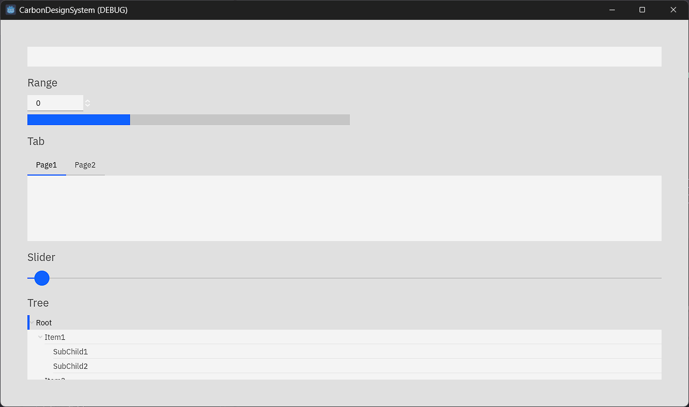
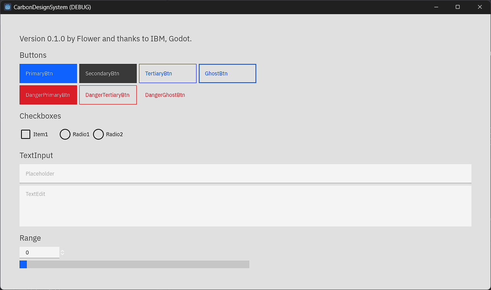

# CarbonGD

Carbon Design System, now in Godot!

Add a theme "Carbon.tres" file based on [Carbon Design System]("https://carbondesignsystem.com") in project/addons/CarbonDesignSystem directory.

## Screenshots

## Credits

[Carbon Design System](https://carbondesignsystem.com/)

[IBM/plex: The package of IBM’s typeface, IBM Plex.](https://github.com/IBM/plex)

[IBM](https://www.ibm.com/us-en)

[Godot Engine](https://godotengine.org/)
